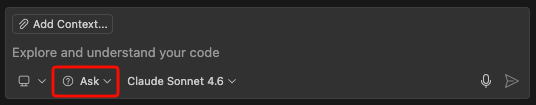
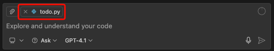

# Lab 02 - Chat Window (Ask Mode)

## Learning Goals

By the end of this lab, you will be able to:
- Use Copilot Chat effectively for various tasks
- Master essential slash commands
- Add context using `@` and `#` references
- Get explanations and learn new concepts
- Refactor code through conversational interaction
- Debug issues with Copilot's help

## Introduction

Copilot Chat is your conversational AI partner. Unlike inline completion, Chat allows for:
- **Multi-turn conversations**: Build on previous messages
- **Complex explanations**: Ask "why" and "how"
- **Guided learning**: Get step-by-step tutorials
- **Code review**: Get feedback on your code

### Opening Copilot Chat

| Action | Mac | Windows/Linux |
|--------|-----|---------------|
| Open Chat Panel | `Cmd+Shift+I` | `Ctrl+Shift+I` |
| Open Chat in Editor | `Cmd+Ctrl+I` | `Ctrl+Alt+I` |
| Quick Chat | `Cmd+Shift+P` → "Chat: Open Quick Chat" | `Ctrl+Shift+P` → "Chat: Open Quick Chat" |

### Make sure the ask mode is selected:
<p>  </p>
---

## Exercise 1: Basic Chatbot Interaction

### Task 1.1: Your First Chat

Open Copilot Chat and try these prompts:

**Greeting and Capabilities:**
```
What can you help me with as a developer?
```

**Project Context:**
```
I'm building a Todo application. What are the essential features I should include?
```

**Architecture Questions:**
```
What's a good file structure for a simple Todo app?
```

**✅ Observe:**
- How Copilot maintains conversation context
- How you can ask follow-up questions
- The formatting of responses (code blocks, lists, etc.)

### Task 1.2: Ask About Your Code

With your Todo file open, try these prompts:

**NOTE:** make sure to select the file in the chat window to provide context for these questions.
<p>  </p>

```
Explain what this file does
```

```
What improvements could I make to this code?
```

```
Are there any bugs or potential issues in this code?
```

---

## Exercise 2: Essential Slash Commands

Slash commands are shortcuts for common tasks. They help Copilot understand your intent quickly.

### Command Reference

| Command | Purpose | Example |
|---------|---------|---------|
| `/explain` | Explain selected code | Select code → `/explain` |
| `/fix` | Fix issues in code | Select buggy code → `/fix` |
| `/tests` | Generate tests | Select function → `/tests` |
| `/doc` | Add documentation | Select function → `/doc` |
| `/clear` | Clear chat history | `/clear` |
| `/new` | Start new chat | `/new` |

### Task 2.1: Explain Code

1. Select a function or class in your code
2. Open Chat and type: `/explain`
3. Copilot will explain the selected code

**Try with different selections:**
- A single function
- An entire class
- A complex expression

### Task 2.2: Fix Issues

1. Introduce a bug in your code (e.g., wrong variable name, missing return)
2. Select the buggy code
3. Type: `/fix`
4. Review Copilot's suggested fix

**Intentional bugs to try:**
```javascript
// JavaScript - Off-by-one error
function getLastTodo(todos) {
    return todos[todos.length];  // Bug: should be length - 1
}
```

```python
# Python - Type error
def add_todo(self, text):
    todo = {"id": self.next_id, "text": text}
    self.next_id + 1  # Bug: should be self.next_id += 1
    return todo
```

### Task 2.3: Generate Tests

1. Select a function from your TodoList class
2. Type: `/tests`
3. Review the generated tests

**Example prompt:**
```
/tests for the addTodo method using Jest
```

**Python example:**
```
/tests for the add_todo method using pytest
```

### Task 2.4: Add Documentation

1. Select an undocumented function
2. Type: `/doc`
3. Copilot will generate appropriate documentation

**Observe** how Copilot:
- Uses the right documentation format (JSDoc, docstrings, XML comments)
- Includes parameter descriptions
- Adds return type information

---

## Exercise 3: Adding Context

Context is crucial for accurate responses. Use `@` and `#` to provide Copilot with the right information.

### Context References

| Reference | Description | Example |
|-----------|-------------|---------|
| `@workspace` | Entire workspace context | `@workspace how is authentication handled?` |
| `@terminal` | Terminal output | `@terminal what does this error mean?` |
| `#file` | Specific file | `#file:todo.js explain this file` |
| `#selection` | Selected text | `#selection refactor this` |

### Task 3.1: Workspace Context

```
@workspace What files make up this Todo application?
```

```
@workspace How are todos stored and retrieved?
```

### Task 3.2: File References

```
#file:todo.js #file:index.html How do these files work together?
```

```
#file:package.json What dependencies does this project use?
```

### Task 3.3: Selection Context

1. Select some code
2. Ask a question with `#selection`:

```
#selection Convert this to use async/await
```

```
#selection What's the time complexity of this?
```

### Task 3.4: Terminal Context

1. Run a command that produces an error
2. Use terminal context:

```
@terminal Explain this error and how to fix it
```

---

## Exercise 4: Learning and Understanding

Use Copilot Chat as your learning partner.

### Task 4.1: Concept Explanations

Try these educational prompts:

```
Explain the difference between == and === in JavaScript
```

```
What is the MVC pattern and how would it apply to my Todo app?
```

```
Explain closures with a simple example
```

### Task 4.2: Best Practices

```
What are the best practices for error handling in this Todo app?
```

```
How should I organize my code as this project grows?
```

```
What security considerations should I have for a Todo app?
```

### Task 4.3: Learning New Patterns

```
Show me how to implement the Observer pattern for my Todo list
```

```
How can I make my TodoList class immutable?
```

---

## Exercise 5: Refactoring with Chat

Chat excels at helping you improve existing code.

### Task 5.1: Simple Refactoring

Select your TodoList class and try:

```
Refactor this class to use more descriptive variable names
```

```
Extract the ID generation into a separate method
```

```
Simplify this code while maintaining the same functionality
```

### Task 5.2: Pattern Refactoring

```
Refactor my addTodo method to use the Builder pattern
```

```
Convert this class-based code to functional style
```

```
Apply the Single Responsibility Principle to this class
```

### Task 5.3: Performance Refactoring

```
How can I optimize the search/filter operations for large todo lists?
```

```
Suggest caching strategies for my todo operations
```

---

## Exercise 6: Build a Feature with Chat

Let's use Chat to build a complete feature: **Local Storage Persistence**

### Step 1: Ask for Guidance

```
I want to add local storage persistence to my Todo app so todos survive browser refresh. How should I approach this?
```

### Step 2: Get Implementation

```
Show me how to implement the save and load functions for localStorage in my TodoList class
```

### Step 3: Ask Follow-up Questions

```
How should I handle the case where localStorage is not available?
```

```
When should I call the save function? On every change or periodically?
```

### Step 4: Review and Improve

```
Review my localStorage implementation. Are there any edge cases I'm missing?
```

---

## Exercise 7: Multi-File Understanding

### Task 7.1: Cross-File Analysis

```
@workspace Explain how the UI interacts with the TodoList class
```

```
@workspace What happens when a user clicks the "Add Todo" button?
```

### Task 7.2: Dependency Analysis

```
@workspace List all the places where the Todo class is used
```

```
@workspace What would break if I renamed the addTodo method?
```

---

## Challenges

### Challenge 1: Code Review Session

Ask Copilot to do a comprehensive code review:
```
Please review my entire TodoList implementation. Focus on:
1. Code quality and readability
2. Potential bugs
3. Performance considerations
4. Security issues
5. Suggestions for improvement
```

### Challenge 2: Architecture Discussion

Have a conversation about architecture:
```
I want to add user authentication to my Todo app. Walk me through:
1. What components I need
2. How to structure the code
3. Security considerations
```

### Challenge 3: Debug a Complex Issue

Introduce a subtle bug and use Chat to find it:
```
I have a bug where todos sometimes don't save correctly. Here's my code... Can you help me find the issue?
```

---

## Pro Tips for Chat

### Writing Better Prompts

| Technique | Example |
|-----------|---------|
| **Be specific** | "Explain the filter method in line 45" not "Explain the code" |
| **Provide context** | "I'm using React 18..." before asking React questions |
| **State constraints** | "Without using any external libraries..." |
| **Ask for options** | "Give me 3 different ways to..." |
| **Request format** | "Explain in bullet points..." |

### Iterating on Responses

- Ask for clarification: "Can you explain that more simply?"
- Request changes: "Show me the same thing but using TypeScript"
- Challenge suggestions: "What are the downsides of this approach?"
- Build on answers: "Now how do I add error handling to that?"

---

## Key Takeaways

| Concept | Takeaway |
|---------|----------|
| **Slash commands** | Use them for quick, focused actions |
| **Context matters** | Use @workspace, #file for accurate answers |
| **Conversation flow** | Build on previous messages |
| **Learning tool** | Ask "why" and "how", not just "what" |
| **Review partner** | Use Chat for code reviews |

---

## What's Next?

You've learned to have productive conversations with Copilot. Now let's use Agent Mode for autonomous multi-step tasks.

👉 Continue to [Lab 03 - Agent Mode](03-agent-mode.md)
